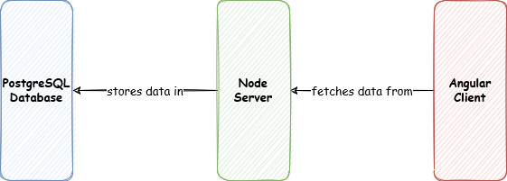

# Udagram

[](https://dl.circleci.com/status-badge/redirect/gh/ahmedsomaa/udagram/tree/master)

A full stack application built with node, postgresql & Angular hosted on Amazon Web Services using CircelCi. The backend API is running [here](http://udagram-api-env-dev.us-east-1.elasticbeanstalk.com) and the frontend is running [here](http://udagram-client.s3-website-us-east-1.amazonaws.com).

## Tech Stack

---

- [Angular](https://angular.io/) - Single Page Application Framework
- [Node](https://nodejs.org) - Javascript Runtime
- [Express](https://expressjs.com/) - Javascript API Framework
- [PostgreSQL](https://www.postgresql.org/) - Database Management System
- [AWS S3](https://aws.amazon.com/s3/) - Static Website Hosting Environment
- [AWS Elastic Beanstalk](https://aws.amazon.com/elasticbeanstalk/) - Node.js Hosting Environment
- [AWS RDS](https://aws.amazon.com/rds/) - PostgreSQL Hosting Environment

## Architecture

---



## Project Dependecies

---

See [dependencies.md](./docs/dependencies.md) for more details.

## Run Locally

---

The project provides a global [package.json](./package.json) that comes with scripts to run, build and deploy project:

- First head to the api directory and add a `.env` file.
- Second add the following environment variables to the `.env` file:

  ```bash
  POSTGRES_HOST=
  POSTGRES_USERNAME=
  POSTGRES_DB=
  POSTGRES_PASSWORD=
  POSTGRES_PORT=
  PORT=
  AWS_REGION=
  AWS_PROFILE=
  AWS_BUCKET=
  URL=
  JWT_SECRET=
  ```

- Then return back to the main directory and run `npm run api:install` to install all the backend dependecies.
- Then run `npm run api:start` to start the backend development server.
- Open another terminal and run `npm run frontend:install` to install all the frontend dependencies.
- Then run `npm run frontend:start` to start the frontend development instance.
- To build the backend api run `npm run api:build` and to build the frontend api run `npm run frontend:build`.

## Deployment Infrastructure and Pipeline

---

See [deployment.md](./docs/deployment.md) for more details.

## Screenshots

---

Screenshots are divided into 2 categories:

- [AWS Resources Configuration](./images/screenshots/aws-configuration/)
- [CircleCi Pipeline](./images/screenshots/circleci/)

## License

---

[License](LICENSE.txt)
