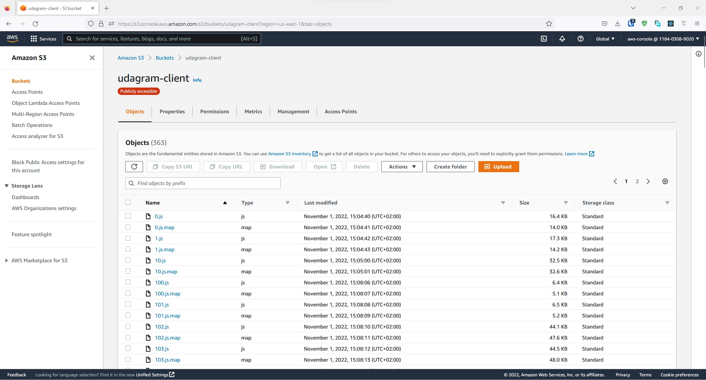
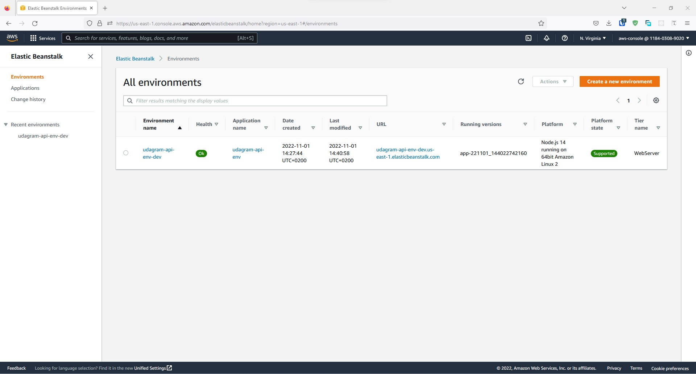
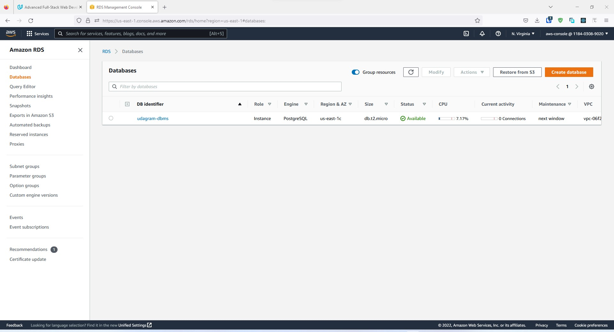
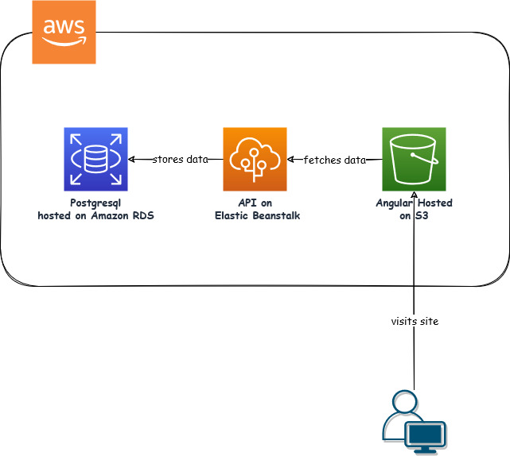
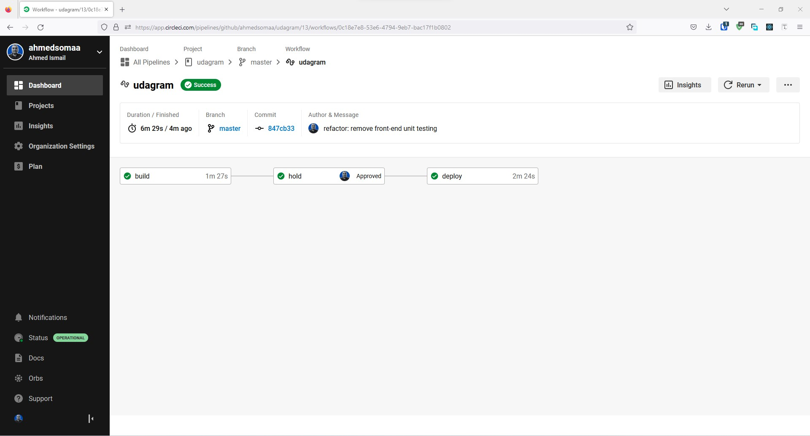
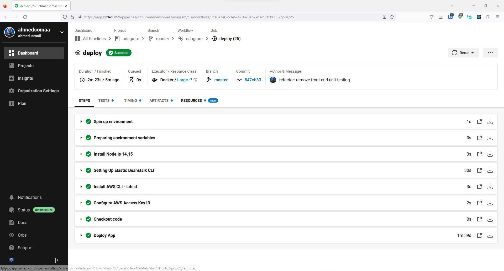

# Deployment Infrastructure and Pipeline

## Infrastructure

The application is modeled using the client server architecture where:

- The angular client is hosted on AWS S3 located [here](http://udagram-client.s3-website-us-east-1.amazonaws.com).

  

- The server application is developed using node.js, express and typescript hosted [here](http://udagram-api-env-dev.us-east-1.elasticbeanstalk.com).

  

- The data is stored on a postgresql database hosted on AWS RDS.

  

### Diagram

The following diagram shows the communication between the three layers.



## Pipeline

---

This project has a circle ci pipeline for building and deploying both the frontend and backend applications.



### Pipeline Process

- Configure the pipeline settings to add the following environment variables:
  ```bash
  AWS_ACCESS_KEY_ID=
  AWS_DEFAULT_REGION=
  AWS_PROFILE=
  AWS_SECRET_ACCESS_KEY=
  ```
  those are required for the `circleci/aws-elastic-beanstalk@2.0.1` & `circleci/aws-cli@3.1.1` orbs to run successfully.
- Setting up orbs to be used in the pipeline which are `circleci/node@5.0.2` to setup and install nodejs environment, `circleci/aws-elastic-beanstalk@2.0.1` to setup and install the elasticbean stalk CLI and `circleci/aws-cli@3.1.1` to setup and install the AWS CLI.
- Setup the build stage to do the following:
  - Install the frontend dependencies.
  - Install the backend dependencies.
  - Linting the frontend project files.
  - Building the frontend project.
  - Building the backend project.
- A successful run for the build stage should look like this

  

- The pipleline is set up to hold and wait for approval for the deploy stage.
- Give approval to the deploy stage in order to start.
- The deploy stage is configured to do the following:
  - Deploy the backend api on AWS Elastic Beanstalk using `eb deploy <environment.name>` command.
  - Deploy the frontend build to ASW S3 using the AWS CLI.
- A successful run for the deploy stage should look like this

  
